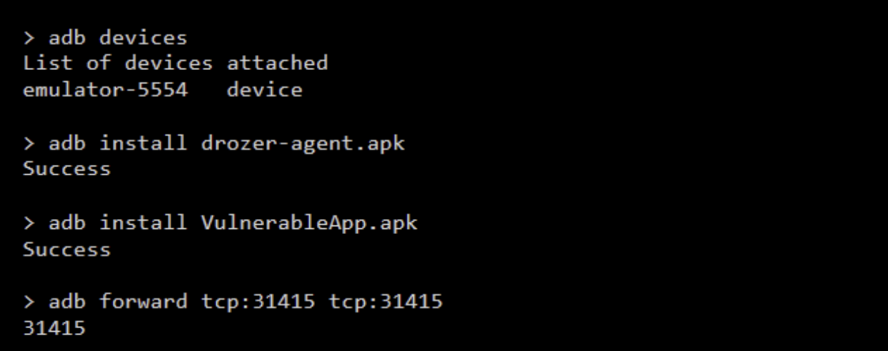
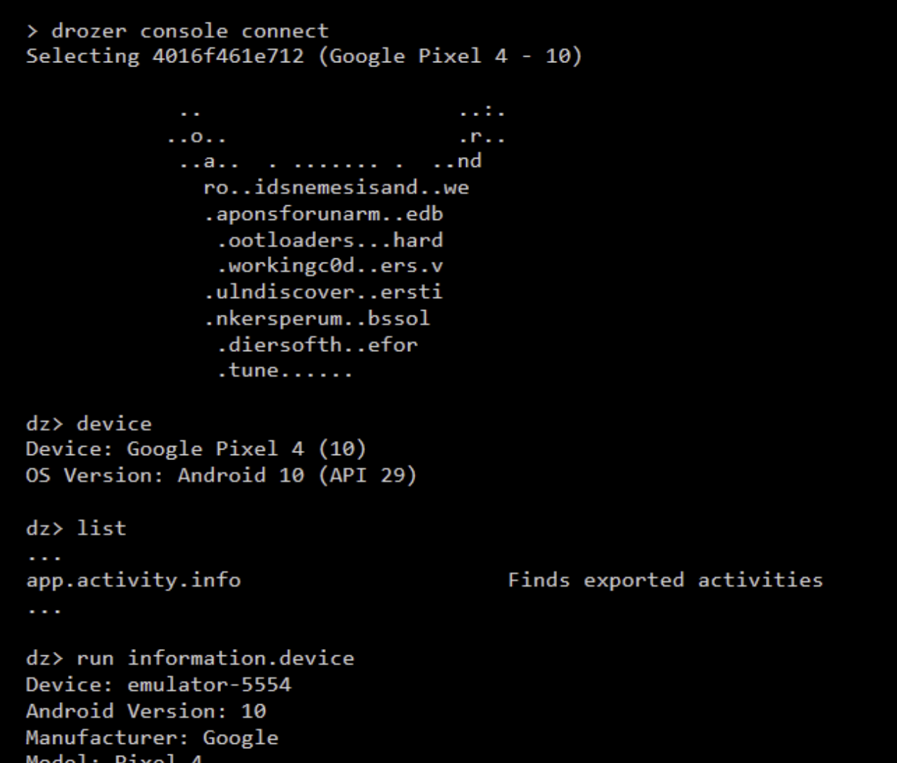
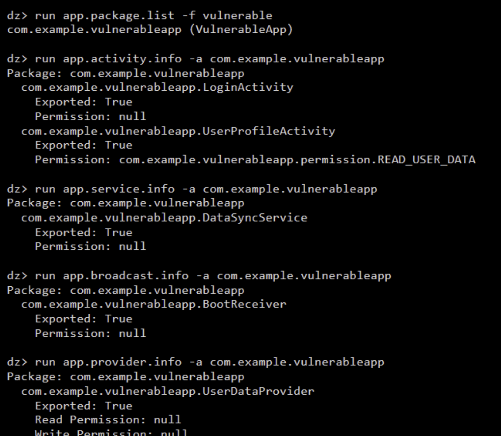
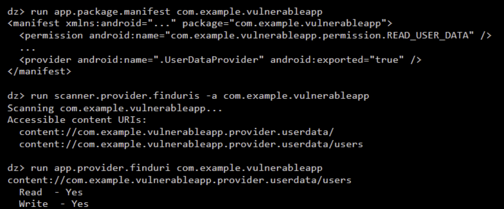

# LAB 9 – Analyse de surface d'attaque Android avec Drozer (audit défensif en environnement autorisé)
 

## Objectifs pédagogiques
- Maîtriser l'utilisation de Drozer pour l'analyse de sécurité d'applications Android
- Identifier les composants Android exposés et leurs vulnérabilités potentielles
- Évaluer les risques de sécurité liés aux composants mal configurés
- Documenter méthodiquement les résultats d'un audit de sécurité
- Proposer des remédiations adaptées conformes aux standards OWASP MASVS

## Prérequis
- Émulateur Android rooté ou appareil physique rooté
- Drozer installé (agent sur l'appareil + console sur la machine hôte)
- APK cible : `VulnerableApp.apk`

## Contexte & Périmètre
Ce laboratoire s'inscrit dans le cadre d'un audit défensif en environnement autorisé. L'objectif est d'utiliser le framework **Drozer** pour interagir avec une application Android volontairement vulnérable (`VulnerableApp.apk`), cartographier sa surface d'attaque et identifier les failles liées à l'exposition non sécurisée de ses composants internes (Activités, Services, Broadcast Receivers, Content Providers).

---

## Déroulement de l'analyse

### Étape 1 – Configuration de l'environnement
Installation de l'agent Drozer et de l'application cible sur l'émulateur via ADB, puis configuration du transfert de port (forwarding) pour permettre la communication entre l'hôte et l'agent.

### Étape 2 – Connexion et validation du canal de communication
Lancement de la console Drozer sur la machine hôte et connexion à l'agent exécuté sur l'émulateur. Vérification des informations de l'appareil pour s'assurer du bon fonctionnement.

### Étape 3 – Cartographie des composants Android exposés
Utilisation des modules Drozer pour lister les packages installés et identifier les composants exposés (Exported: True) de l'application cible qui pourraient être appelés par des applications tierces malveillantes.

### Étape 4 – Vérification des protections
Analyse approfondie du manifeste (`AndroidManifest.xml`) et des composants spécifiques (comme les Content Providers) pour vérifier si les permissions d'accès (Read/Write) sont correctement implémentées ou s'ils sont accessibles publiquement.

### Étape 5 – Analyse des risques
Les composants exposés sans permissions strictes (ex: `UserDataProvider` avec Read/Write: null) représentent un risque élevé (fuite de données sensibles, falsification de données).

### Étape 6 – Collecte de preuves
Les commandes Drozer exécutées démontrent qu'il est possible de lister et d'interagir avec les URI des Content Providers vulnérables.

---

## Triage et Priorisation
- **Haute Sévérité :** Content Provider (`UserDataProvider`) exporté sans permission. Permet un accès total en lecture/écriture aux données utilisateur.
- **Sévérité Moyenne :** Activités et Services exportés (`LoginActivity`, `DataSyncService`) pouvant être manipulés pour contourner le flux normal de l'application.

## Mapping OWASP MASVS / MASTG
- **MSTG-PLATFORM-1 :** "The app only requests the minimum set of permissions necessary."
- **MSTG-PLATFORM-2 :** "All inputs from external sources and the user are validated and if necessary sanitized. This includes data received via the UI, IPC mechanisms such as intents, custom URLs, and network sources."
- **V4: Interaction avec la plateforme :** Les composants exportés ne doivent pas divulguer de données sensibles.

## Remédiations Détaillées
1. **Composants non nécessaires en externe :** Définir `android:exported="false"` dans le manifeste pour toutes les activités, services, et providers qui ne doivent pas être appelés par d'autres applications.
2. **Permissions personnalisées :** Si un composant doit être exporté, le protéger en exigeant une permission de niveau `signature` pour restreindre l'accès aux seules applications du même développeur.
3. **Validation des entrées :** Systématiquement valider et assainir les données reçues via les Intents ou les requêtes vers les Content Providers.

## Livrables à rendre
- Rapport d'analyse au format PDF.
- Captures d'écran des commandes Drozer (incluses dans ce README).

## Barème d'évaluation
*Évaluation basée sur la précision de la cartographie, la pertinence des risques identifiés et la qualité des remédiations proposées.*

---

## Conclusion personnelle et difficultés rencontrées
Ce lab permet de prendre en main la puissance de Drozer en tant que framework d'audit interactif. La syntaxe des modules est très intuitive. La principale difficulté est de bien comprendre l'architecture IPC d'Android pour exploiter correctement les failles identifiées.

[Lien vers le dépôt GitHub](https://github.com/Oumaymaa659/LAB-9-Analyse-de-surface-d-attaque-Android-avec-Drozer-audit-d-fensif-en-environnement-autoris-)
